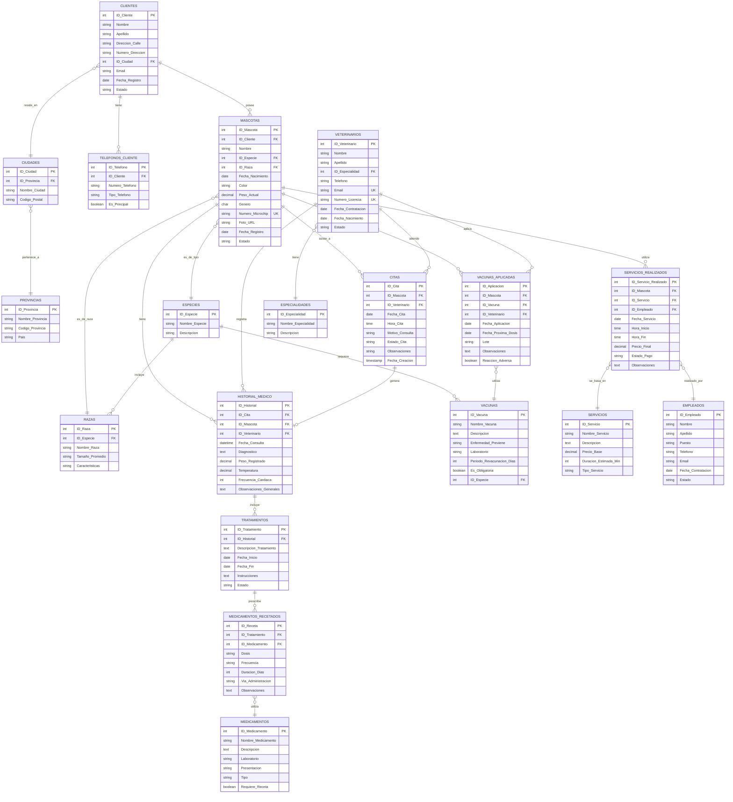

# MODELO ENTIDAD-RELACIÓN (MER) - CLÍNICA VETERINARIA

## Diagrama ER Completo



## RELACIONES PRINCIPALES

### 1. CLIENTE - MASCOTA (1:N)
- Un cliente puede tener múltiples mascotas
- Una mascota pertenece a un solo cliente
- **Tipo**: Identificativa (la mascota no existe sin cliente)

### 2. MASCOTA - CITA (1:N)
- Una mascota puede tener múltiples citas
- Una cita es para una sola mascota
- **Tipo**: Regular

### 3. VETERINARIO - CITA (1:N)
- Un veterinario puede atender múltiples citas
- Una cita es atendida por un solo veterinario
- **Tipo**: Regular

### 4. CITA - HISTORIAL_MEDICO (1:1)
- Una cita puede generar un registro de historial médico
- Un historial médico corresponde a una cita específica
- **Tipo**: Opcional (no todas las citas generan historial)

### 5. HISTORIAL_MEDICO - TRATAMIENTO (1:N)
- Un historial médico puede incluir múltiples tratamientos
- Un tratamiento pertenece a un historial específico
- **Tipo**: Identificativa

### 6. TRATAMIENTO - MEDICAMENTO (N:M)
- Un tratamiento puede incluir múltiples medicamentos
- Un medicamento puede ser usado en múltiples tratamientos
- **Tabla intermedia**: MEDICAMENTOS_RECETADOS

### 7. MASCOTA - VACUNA (N:M)
- Una mascota puede recibir múltiples vacunas
- Una vacuna puede ser aplicada a múltiples mascotas
- **Tabla intermedia**: VACUNAS_APLICADAS

### 8. MASCOTA - SERVICIO (N:M)
- Una mascota puede recibir múltiples servicios
- Un servicio puede ser aplicado a múltiples mascotas
- **Tabla intermedia**: SERVICIOS_REALIZADOS

### 9. ESPECIE - RAZA (1:N)
- Una especie tiene múltiples razas
- Una raza pertenece a una sola especie
- **Tipo**: Identificativa

### 10. CIUDAD - PROVINCIA (N:1)
- Una provincia tiene múltiples ciudades
- Una ciudad pertenece a una sola provincia
- **Tipo**: Identificativa

## CARDINALIDADES DETALLADAS

```
CLIENTE (1,1) ----< (1,N) MASCOTA
CLIENTE (1,1) ----< (0,N) TELEFONO_CLIENTE
CLIENTE (1,1) >---- (1,1) CIUDAD

CIUDAD (N,1) >---- (1,1) PROVINCIA

MASCOTA (1,1) >---- (1,1) ESPECIE
MASCOTA (1,1) >---- (1,1) RAZA
MASCOTA (1,1) ----< (0,N) CITA
MASCOTA (1,1) ----< (0,N) HISTORIAL_MEDICO
MASCOTA (1,1) ----< (0,N) VACUNA_APLICADA
MASCOTA (1,1) ----< (0,N) SERVICIO_REALIZADO

ESPECIE (1,1) ----< (1,N) RAZA
ESPECIE (1,1) ----< (0,N) VACUNA

VETERINARIO (1,1) >---- (1,1) ESPECIALIDAD
VETERINARIO (1,1) ----< (0,N) CITA
VETERINARIO (1,1) ----< (0,N) HISTORIAL_MEDICO
VETERINARIO (1,1) ----< (0,N) VACUNA_APLICADA

CITA (1,1) ----< (0,1) HISTORIAL_MEDICO

HISTORIAL_MEDICO (1,1) ----< (0,N) TRATAMIENTO

TRATAMIENTO (1,1) ----< (0,N) MEDICAMENTO_RECETADO

MEDICAMENTO_RECETADO (N,1) >---- (1,1) MEDICAMENTO

VACUNA_APLICADA (N,1) >---- (1,1) VACUNA

SERVICIO_REALIZADO (N,1) >---- (1,1) SERVICIO
SERVICIO_REALIZADO (N,1) >---- (1,1) EMPLEADO
```

## RESTRICCIONES DE INTEGRIDAD

### Claves Primarias (PK)
- Todas las entidades tienen una clave primaria surrogate (ID autoincremental)
- Garantizan unicidad de cada registro

### Claves Foráneas (FK)
- Implementan las relaciones entre entidades
- Mantienen integridad referencial

### Claves Únicas (UK)
- `MASCOTAS.Numero_Microchip` - Un microchip es único por mascota
- `VETERINARIOS.Email` - Evita duplicación de veterinarios
- `VETERINARIOS.Numero_Licencia` - La licencia es única

### Restricciones de Dominio
- `MASCOTAS.Genero` ∈ {'M', 'F', 'I'}
- `CITAS.Estado_Cita` ∈ {'pendiente', 'en_proceso', 'completada', 'cancelada', 'no_asistio'}
- `SERVICIOS_REALIZADOS.Estado_Pago` ∈ {'pendiente', 'pagado', 'cancelado'}
- `Fecha_Nacimiento < CURRENT_DATE`

### Restricciones de Negocio
- La fecha de próxima dosis de vacuna debe ser posterior a la fecha de aplicación
- El peso registrado debe ser mayor a 0
- La temperatura debe estar en un rango razonable (30-45°C para la mayoría)
- La fecha de fin de tratamiento debe ser posterior o igual a la fecha de inicio

