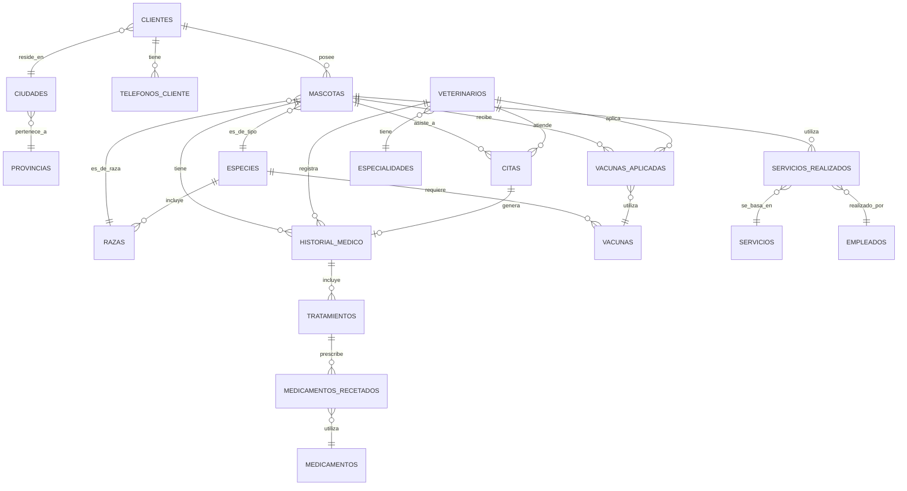

# DISEÑO E IMPLEMENTACIÓN DE UN SISTEMA DE GESTIÓN DE BASE DE DATOS PARA CLÍNICA VETERINARIA

**Aplicación de Normalización y Modelado de Datos Relacional**

---

## INFORMACIÓN DEL DOCUMENTO

**Institución:** Universidad Tecnológica  
**Carrera:** Ingeniería en Sistemas Computacionales  
**Asignatura:** Bases de Datos Relacionales  
**Ciclo Académico:** 2025-2026  

**Autor(es):**  
[Nombre del estudiante]  
[Código/Matrícula]

**Docente:**  
[Nombre del profesor]

**Fecha de elaboración:** 01 de Febrero de 2026

**Versión:** 1.0

---

## DECLARACIÓN DE ORIGINALIDAD

El presente documento ha sido elaborado con fines académicos como parte de las actividades evaluativas de la asignatura de Bases de Datos Relacionales. Todo el contenido técnico, diagramas, scripts y análisis presentados son producto del trabajo de investigación y desarrollo del(los) autor(es), utilizando como base los fundamentos teóricos estudiados en clase y referencias bibliográficas citadas al final del documento.

---

<div style="page-break-after: always;"></div>

## ÍNDICE GENERAL

### CONTENIDO

**I. SECCIÓN PRELIMINAR**

1. Portada y Datos Institucionales .................................................... 1
2. Índice General ...................................................................... 2
3. Índice de Figuras .................................................................. 3
4. Índice de Tablas ................................................................... 4
5. Resumen Ejecutivo .................................................................. 5
6. Abstract ............................................................................ 6

**II. INTRODUCCIÓN**

1. Planteamiento del Problema ...................................................... 7
2. Justificación ...................................................................... 8
3. Objetivos .......................................................................... 9
   - 3.1. Objetivo General ........................................................... 9
   - 3.2. Objetivos Específicos ..................................................... 9
4. Alcance y Limitaciones ........................................................... 10

**III. MARCO TEÓRICO**

1. Sistemas de Gestión de Bases de Datos Relacionales (SGBDR) ..................... 11
2. Modelo Entidad-Relación (MER) ................................................... 12
3. Modelo Relacional ................................................................ 13
4. Teoría de Normalización .......................................................... 14
   - 4.1. Primera Forma Normal (1FN) ............................................... 14
   - 4.2. Segunda Forma Normal (2FN) ............................................... 15
   - 4.3. Tercera Forma Normal (3FN) ............................................... 15
5. Integridad Referencial y Restricciones ........................................... 16

**IV. DESARROLLO DEL PROYECTO**

1. Análisis del Dominio del Problema ............................................... 17
2. Modelo Entidad-Relación (MER) ................................................... 18
   - 2.1. Entidades Identificadas .................................................. 18
   - 2.2. Relaciones entre Entidades ............................................... 20
   - 2.3. Atributos y Restricciones ................................................ 22
   - 2.4. Cardinalidades ........................................................... 24
   - 2.5. Diagrama ER Completo ..................................................... 26

---

<div style="page-break-after: always;"></div>

## ÍNDICE DE FIGURAS

**Figura 1:** Arquitectura de Tres Niveles de un SGBD ................................ 11  
**Figura 2:** Ciclo de Vida del Diseño de Bases de Datos ............................. 12  
**Figura 3:** Diagrama Entidad-Relación Completo del Sistema ......................... 26  
**Figura 4:** Módulo de Gestión de Clientes y Ubicaciones ............................ 28  
**Figura 5:** Módulo de Gestión de Mascotas .......................................... 29  
**Figura 6:** Módulo de Gestión de Veterinarios ...................................... 30  
**Figura 7:** Módulo de Gestión de Citas ............................................. 31  
**Figura 8:** Módulo de Historial Médico y Tratamientos .............................. 32  
**Figura 9:** Módulo de Medicamentos ................................................. 33  
**Figura 10:** Módulo de Vacunas ..................................................... 34  
**Figura 11:** Módulo de Servicios ................................................... 35  

---

## ÍNDICE DE TABLAS

**Tabla 1:** Comparativa de SGBD Relacionales ........................................ 11  
**Tabla 2:** Resumen de Entidades del Sistema ........................................ 19  
**Tabla 3:** Resumen de Relaciones del Sistema ....................................... 21  
**Tabla 4:** Tipos de Cardinalidades en el Modelo .................................... 24  
**Tabla 5:** Atributos por Entidad ................................................... 23  
**Tabla 6:** Restricciones de Integridad ............................................. 25  

---

<div style="page-break-after: always;"></div>

## RESUMEN EJECUTIVO

El presente documento técnico describe el proceso completo de diseño, modelado e implementación de un Sistema de Gestión de Base de Datos (SGBD) para una clínica veterinaria, utilizando el modelo relacional y el sistema gestor PostgreSQL. El proyecto surge de la necesidad de optimizar y sistematizar el manejo de información crítica relacionada con la atención veterinaria, incluyendo registros de clientes, mascotas, citas médicas, historiales clínicos, tratamientos, vacunación y servicios complementarios.

La metodología aplicada siguió un enfoque estructurado basado en la teoría clásica de bases de datos relacionales, comenzando con un análisis exhaustivo del dominio del problema, seguido por el diseño conceptual mediante el Modelo Entidad-Relación (MER), posteriormente la transformación al Modelo Relacional, y finalmente la aplicación rigurosa del proceso de normalización hasta alcanzar la Tercera Forma Normal (3FN).

El sistema resultante está compuesto por 19 tablas distribuidas en 9 módulos funcionales: (1) Gestión de Ubicaciones, (2) Gestión de Clientes, (3) Gestión de Mascotas, (4) Gestión de Veterinarios, (5) Gestión de Citas, (6) Historial Médico y Tratamientos, (7) Medicamentos, (8) Vacunas, y (9) Servicios. Cada módulo ha sido diseñado considerando los principios de integridad referencial, atomicidad de datos, eliminación de redundancias y optimización de consultas.

Los resultados obtenidos demuestran que una base de datos correctamente normalizada no solo mejora la integridad y consistencia de los datos, sino que también facilita el mantenimiento, escalabilidad y eficiencia operacional del sistema. El proyecto incluye scripts completos de creación de base de datos, inserción de datos de prueba y consultas avanzadas que validan la funcionalidad del diseño propuesto.

**Palabras clave:** Base de datos relacional, Normalización, Modelo Entidad-Relación, PostgreSQL, Sistema de gestión veterinaria, Integridad referencial, 3FN.

---

<div style="page-break-after: always;"></div>

## ABSTRACT

This technical document describes the complete process of design, modeling and implementation of a Database Management System (DBMS) for a veterinary clinic, using the relational model and the PostgreSQL management system. The project arises from the need to optimize and systematize the management of critical information related to veterinary care, including records of clients, pets, medical appointments, clinical histories, treatments, vaccination and complementary services.

The applied methodology followed a structured approach based on classical relational database theory, starting with an exhaustive analysis of the problem domain, followed by conceptual design through the Entity-Relationship Model (ERM), subsequently transformation to the Relational Model, and finally rigorous application of the normalization process to reach Third Normal Form (3NF).

The resulting system consists of 19 tables distributed across 9 functional modules: (1) Location Management, (2) Client Management, (3) Pet Management, (4) Veterinarian Management, (5) Appointment Management, (6) Medical History and Treatments, (7) Medications, (8) Vaccines, and (9) Services. Each module has been designed considering the principles of referential integrity, data atomicity, redundancy elimination and query optimization.

The obtained results demonstrate that a properly normalized database not only improves data integrity and consistency, but also facilitates system maintenance, scalability and operational efficiency. The project includes complete scripts for database creation, test data insertion and advanced queries that validate the functionality of the proposed design.

**Keywords:** Relational database, Normalization, Entity-Relationship Model, PostgreSQL, Veterinary management system, Referential integrity, 3NF.

---

<div style="page-break-after: always;"></div>

## I. INTRODUCCIÓN

### 1.1. PLANTEAMIENTO DEL PROBLEMA

En el contexto actual, las clínicas veterinarias enfrentan desafíos significativos en la gestión eficiente de información relacionada con sus operaciones diarias. La naturaleza compleja de los datos veterinarios, que incluyen información de múltiples clientes, diversas especies de mascotas, historiales médicos extensos, tratamientos especializados, programas de vacunación y servicios complementarios, requiere un sistema de almacenamiento estructurado que garantice integridad, consistencia y disponibilidad de la información.

Tradicionalmente, muchas clínicas veterinarias han operado con sistemas de información fragmentados, hojas de cálculo desconectadas o incluso registros en papel, lo que genera múltiples problemáticas:

1. **Redundancia de datos:** La misma información se almacena en múltiples ubicaciones, generando inconsistencias y dificultad para mantener datos actualizados.

2. **Anomalías de actualización:** Cambios en la información de un cliente o mascota requieren actualizaciones en múltiples registros, aumentando el riesgo de errores.

3. **Pérdida de integridad referencial:** La ausencia de relaciones formales entre datos relacionados dificulta el seguimiento completo del historial de una mascota.

4. **Dificultad en la recuperación de información:** Las consultas complejas que requieren datos de múltiples fuentes se vuelven ineficientes o imposibles de realizar.

5. **Escalabilidad limitada:** Los sistemas no estructurados no pueden crecer adecuadamente conforme aumenta el volumen de información.

6. **Ausencia de reportes y análisis:** La falta de estructura dificulta la generación de reportes estadísticos y análisis de tendencias necesarios para la toma de decisiones gerenciales.

Ante esta problemática, surge la necesidad de diseñar e implementar un Sistema de Gestión de Base de Datos Relacional (SGBDR) que aborde estos desafíos mediante la aplicación de principios sólidos de diseño de bases de datos, específicamente el modelado Entidad-Relación y el proceso de normalización hasta la Tercera Forma Normal (3FN).

---

### 1.2. JUSTIFICACIÓN

El desarrollo de este proyecto de base de datos para una clínica veterinaria se justifica desde múltiples perspectivas:

#### 1.2.1. Justificación Técnica

Desde el punto de vista técnico, la implementación de un SGBDR correctamente diseñado y normalizado proporciona:

- **Integridad de datos:** Las restricciones de integridad referencial garantizan que las relaciones entre entidades se mantengan consistentes.
- **Eliminación de redundancias:** La normalización hasta 3FN asegura que cada dato se almacene en un único lugar.
- **Optimización de consultas:** Una estructura bien diseñada permite consultas eficientes mediante el uso apropiado de índices y relaciones.
- **Escalabilidad:** La arquitectura modular facilita el crecimiento del sistema sin necesidad de rediseños fundamentales.

#### 1.2.2. Justificación Operativa

Desde la perspectiva operativa, el sistema propuesto permite:

- **Mejora en la eficiencia operacional:** Acceso rápido y confiable a información crítica durante la atención veterinaria.
- **Reducción de errores:** La validación automática de datos mediante constraints reduce errores humanos.
- **Trazabilidad completa:** Historial completo de cada mascota desde su registro hasta tratamientos actuales.
- **Gestión de citas optimizada:** Prevención de conflictos de horarios y mejor distribución de recursos.

#### 1.2.3. Justificación Académica

Este proyecto constituye una aplicación práctica de los conceptos fundamentales de bases de datos relacionales estudiados en el curso, permitiendo:

- Aplicar la teoría del Modelo Entidad-Relación en un caso real.
- Experimentar el proceso completo de normalización (0FN hasta 3FN).
- Implementar restricciones de integridad y reglas de negocio.
- Desarrollar scripts SQL complejos para creación y manipulación de datos.
- Evaluar el desempeño y eficiencia de diferentes estrategias de modelado.

#### 1.2.4. Justificación Social

El proyecto tiene impacto social al:

- Mejorar la calidad de atención veterinaria mediante mejor gestión de información.
- Facilitar el seguimiento de programas de vacunación, contribuyendo a la salud pública.
- Permitir análisis epidemiológicos y estadísticos que benefician a la comunidad veterinaria.

---

<div style="page-break-after: always;"></div>

## 2. OBJETIVOS

### 2.1. OBJETIVO GENERAL

Diseñar, modelar e implementar un Sistema de Gestión de Base de Datos Relacional para una clínica veterinaria utilizando PostgreSQL, aplicando metodologías formales de diseño conceptual mediante el Modelo Entidad-Relación (MER), transformación al Modelo Relacional (MR) y normalización hasta la Tercera Forma Normal (3FN), garantizando integridad, consistencia y eficiencia en el manejo de información relacionada con clientes, mascotas, atención veterinaria, tratamientos y servicios.

### 2.2. OBJETIVOS ESPECÍFICOS

1. **Objetivo Específico 1: Análisis del Dominio**
   
   Realizar un análisis exhaustivo del dominio de aplicación identificando todas las entidades, atributos, relaciones y restricciones de negocio necesarias para representar adecuadamente las operaciones de una clínica veterinaria.

2. **Objetivo Específico 2: Diseño Conceptual**
   
   Elaborar el Modelo Entidad-Relación (MER) completo del sistema, definiendo claramente las entidades principales, sus atributos, las relaciones entre ellas con sus respectivas cardinalidades, y las restricciones de integridad aplicables.

3. **Objetivo Específico 3: Transformación al Modelo Relacional**
   
   Realizar la transformación sistemática del Modelo Entidad-Relación al Modelo Relacional, definiendo los esquemas de cada tabla con sus claves primarias, claves foráneas, y restricciones de dominio.

4. **Objetivo Específico 4: Proceso de Normalización**
   
   Aplicar el proceso formal de normalización desde la forma no normalizada (0FN) hasta la Tercera Forma Normal (3FN), documentando cada etapa del proceso, identificando dependencias funcionales y eliminando anomalías de datos.

5. **Objetivo Específico 5: Implementación Física**
   
   Desarrollar los scripts SQL completos para la creación de la base de datos en PostgreSQL, incluyendo definición de tablas, índices, triggers, y constraints necesarios para garantizar la integridad del sistema.

6. **Objetivo Específico 6: Validación del Diseño**
   
   Crear un conjunto completo de datos de prueba y consultas SQL avanzadas que permitan validar la funcionalidad, integridad y eficiencia del diseño de base de datos propuesto.

7. **Objetivo Específico 7: Documentación Técnica**
   
   Elaborar documentación técnica completa del proyecto que incluya diagramas, esquemas relacionales, diccionario de datos, y guías de implementación que faciliten el mantenimiento y evolución futura del sistema.

---

### 2.3. ALCANCE DEL PROYECTO

#### 2.3.1. Alcance Funcional

El sistema de base de datos abarca los siguientes módulos funcionales:

**Módulos Incluidos:**

1. **Gestión de Ubicaciones Geográficas**
   - Registro de provincias y ciudades
   - Códigos postales y organización territorial

2. **Gestión de Clientes**
   - Información personal de propietarios de mascotas
   - Datos de contacto (múltiples teléfonos)
   - Direcciones completas

3. **Gestión de Mascotas**
   - Especies y razas
   - Información individual de cada mascota
   - Número de microchip único
   - Estados (activo, fallecido, adoptado)

4. **Gestión de Veterinarios**
   - Datos profesionales de veterinarios
   - Especialidades médicas
   - Información de licencias profesionales

5. **Gestión de Citas**
   - Programación de consultas veterinarias
   - Estados de citas
   - Prevención de conflictos de horarios

6. **Historial Médico y Tratamientos**
   - Diagnósticos médicos
   - Tratamientos prescritos
   - Signos vitales registrados

7. **Gestión de Medicamentos**
   - Catálogo de medicamentos
   - Prescripciones médicas
   - Dosificación y vías de administración

8. **Gestión de Vacunas**
   - Catálogo de vacunas disponibles
   - Registro de vacunación
   - Control de fechas de revacunación

9. **Gestión de Servicios Complementarios**
   - Servicios de estética, hospedaje y adiestramiento
   - Registro de empleados
   - Control de servicios realizados y facturación

#### 2.3.2. Alcance Técnico

**Tecnologías y Herramientas:**
- Sistema Gestor: PostgreSQL 12 o superior
- Lenguaje de definición: SQL (DDL)
- Lenguaje de manipulación: SQL (DML)
- Nivel de normalización: Tercera Forma Normal (3FN)

**Aspectos Técnicos Cubiertos:**
- Diseño conceptual (MER)
- Diseño lógico (Modelo Relacional)
- Normalización formal (0FN → 1FN → 2FN → 3FN)
- Integridad referencial
- Constraints y validaciones
- Índices para optimización
- Scripts de creación y población de datos

#### 2.3.3. Limitaciones del Proyecto

**Limitaciones Funcionales:**
- No incluye módulo de facturación completo
- No contempla gestión de inventario de medicamentos
- No incluye sistema de recordatorios automáticos
- No abarca módulo de recursos humanos completo

**Limitaciones Técnicas:**
- El diseño no incluye aspectos de seguridad avanzada
- No se desarrolla interfaz gráfica de usuario
- No se implementan procedimientos almacenados complejos
- No se abordan aspectos de replicación o alta disponibilidad

**Limitaciones Temporales:**
- El proyecto se limita al diseño e implementación de la base de datos
- No incluye período de pruebas en ambiente productivo

---

<div style="page-break-after: always;"></div>

## III. MARCO TEÓRICO

### 3.1. SISTEMAS DE GESTIÓN DE BASES DE DATOS RELACIONALES (SGBDR)

#### 3.1.1. Concepto y Características

Un Sistema de Gestión de Bases de Datos Relacional (SGBDR) es un software que permite crear, administrar y manipular bases de datos organizadas según el modelo relacional propuesto por Edgar F. Codd en 1970 (Codd, 1970). Este modelo se fundamenta en la teoría matemática de relaciones y álgebra relacional.

**Características fundamentales de un SGBDR:**

1. **Independencia de datos:** Separación entre los niveles físico, lógico y de vista.
2. **Integridad de datos:** Garantía de exactitud y consistencia mediante constraints.
3. **Seguridad:** Control de acceso basado en privilegios y roles.
4. **Concurrencia:** Manejo simultáneo de múltiples transacciones.
5. **Recuperación:** Capacidad de restaurar el estado consistente tras fallos.
6. **Consultas declarativas:** Uso de SQL para especificar qué datos se necesitan, no cómo obtenerlos.

#### 3.1.2. Arquitectura ANSI-SPARC

La arquitectura de tres niveles propuesta por ANSI-SPARC define:

**Nivel Externo (Vista):**
- Representa la percepción de los datos por diferentes usuarios
- Múltiples vistas pueden existir sobre la misma base de datos
- Proporciona independencia lógica de datos

**Nivel Conceptual (Lógico):**
- Describe la estructura completa de la base de datos
- Define entidades, relaciones y restricciones
- Independiente de la implementación física

**Nivel Interno (Físico):**
- Describe cómo se almacenan físicamente los datos
- Incluye estructuras de almacenamiento e índices
- Dependiente del SGBD específico

#### 3.1.3. PostgreSQL como SGBDR

PostgreSQL es un sistema de gestión de bases de datos objeto-relacional (ORDBMS) de código abierto que ofrece:

- **Conformidad con estándares SQL:** Cumple con SQL:2016
- **Tipos de datos avanzados:** JSON, XML, Arrays, etc.
- **Extensibilidad:** Capacidad de definir tipos y funciones personalizadas
- **Transacciones ACID:** Atomicidad, Consistencia, Aislamiento y Durabilidad
- **Soporte completo de integridad referencial:** Foreign keys, checks, triggers
- **Rendimiento:** Optimizador de consultas avanzado y soporte para índices especializados

### 3.2. MODELO ENTIDAD-RELACIÓN (MER)

#### 3.2.1. Fundamentos Teóricos

El Modelo Entidad-Relación (Entity-Relationship Model), propuesto por Peter Chen en 1976, es una herramienta de modelado conceptual que permite representar la estructura lógica de una base de datos mediante un esquema gráfico de alto nivel (Chen, 1976).

**Componentes principales:**

1. **Entidades:** Objetos del mundo real sobre los cuales se desea almacenar información
   - Entidades fuertes: Existen independientemente
   - Entidades débiles: Dependen de otras entidades para su identificación

2. **Atributos:** Propiedades o características de las entidades
   - Simples vs. Compuestos
   - Monovalorados vs. Multivalorados
   - Derivados
   - Clave (identificadores únicos)

3. **Relaciones:** Asociaciones significativas entre entidades
   - Grado de la relación (unaria, binaria, ternaria, n-aria)
   - Cardinalidad (1:1, 1:N, N:M)
   - Participación (total o parcial)

#### 3.2.2. Notación del Diagrama ER

Existen varias notaciones para representar diagramas ER:

**Notación Chen:** 
- Entidades: Rectángulos
- Atributos: Óvalos conectados a entidades
- Relaciones: Rombos

**Notación Crow's Foot (Pata de Gallo):**
- Más visual para cardinalidades
- Ampliamente usada en herramientas CASE

**Notación UML:**
- Orientada a objetos
- Integrada con diagramas de clases

#### 3.2.3. Cardinalidades y Participación

**Cardinalidad:** Define el número de instancias de una entidad que pueden asociarse con instancias de otra entidad.

- **Uno a Uno (1:1):** Una instancia de A se relaciona con exactamente una instancia de B
- **Uno a Muchos (1:N):** Una instancia de A se relaciona con cero o más instancias de B
- **Muchos a Muchos (N:M):** Múltiples instancias de A se relacionan con múltiples instancias de B

**Participación:**
- **Total:** Toda instancia de la entidad debe participar en la relación
- **Parcial:** La participación es opcional

### 3.3. MODELO RELACIONAL

#### 3.3.1. Fundamentos Matemáticos

El modelo relacional se basa en la teoría de conjuntos y lógica de predicados de primer orden. Conceptos fundamentales:

**Relación (Tabla):** Conjunto de tuplas que comparten los mismos atributos.

**Tupla (Fila):** Conjunto ordenado de valores que representa una instancia de la relación.

**Atributo (Columna):** Nombre que describe el significado de un valor en una tupla.

**Dominio:** Conjunto de valores atómicos permitidos para un atributo.

**Grado:** Número de atributos en una relación.

**Cardinalidad:** Número de tuplas en una relación.

#### 3.3.2. Claves

**Superclave:** Conjunto de atributos que identifican únicamente cada tupla.

**Clave Candidata:** Superclave minimal (no puede eliminarse ningún atributo sin perder unicidad).

**Clave Primaria (PK):** Clave candidata elegida para identificar tuplas.

**Clave Foránea (FK):** Atributo(s) que referencian la clave primaria de otra relación.

**Clave Alternativa:** Claves candidatas no seleccionadas como primarias.

#### 3.3.3. Integridad Referencial

Conjunto de reglas que garantizan la consistencia entre relaciones relacionadas:

**Integridad de Entidad:** La clave primaria no puede contener valores NULL.

**Integridad Referencial:** Los valores de claves foráneas deben existir en la tabla referenciada o ser NULL.

**Acciones Referenciales:**
- `CASCADE`: Propaga cambios/eliminaciones
- `RESTRICT`: Previene cambios que violarían integridad
- `SET NULL`: Establece NULL en caso de eliminación
- `SET DEFAULT`: Establece valor por defecto

### 3.4. TEORÍA DE NORMALIZACIÓN

#### 3.4.1. Conceptos Fundamentales

La normalización es el proceso de organizar datos en una base de datos para reducir redundancia y dependencias no deseadas, mejorando así la integridad de los datos (Elmasri & Navathe, 2015).

**Objetivos de la normalización:**
1. Eliminar redundancia de datos
2. Prevenir anomalías de actualización, inserción y eliminación
3. Simplificar consultas y mantenimiento
4. Asegurar dependencias funcionales apropiadas

#### 3.4.2. Dependencias Funcionales

Una dependencia funcional X → Y establece que el valor de X determina únicamente el valor de Y.

**Tipos de dependencias:**
- **Trivial:** Y ⊆ X (ejemplo: {A, B} → A)
- **No trivial:** Y ⊄ X
- **Completa:** Y depende de todo X, no de un subconjunto
- **Parcial:** Y depende de un subconjunto de X
- **Transitiva:** X → Y y Y → Z implica X → Z

#### 3.4.3. Formas Normales

**Primera Forma Normal (1FN):**
Una relación está en 1FN si todos sus atributos contienen valores atómicos (indivisibles) y no hay grupos repetitivos.

**Segunda Forma Normal (2FN):**
Una relación está en 2FN si está en 1FN y todos los atributos no primos dependen funcionalmente de forma completa de la clave primaria.

**Tercera Forma Normal (3FN):**
Una relación está en 3FN si está en 2FN y no existen dependencias transitivas de atributos no primos respecto a la clave primaria.

**Forma Normal de Boyce-Codd (FNBC):**
Una relación está en FNBC si para toda dependencia funcional X → Y, X es superclave.

---

<div style="page-break-after: always;"></div>

## IV. MODELO ENTIDAD-RELACIÓN (MER)

### 4.1. ANÁLISIS DEL DOMINIO DEL PROBLEMA

#### 4.1.1. Descripción del Contexto

Una clínica veterinaria moderna debe gestionar información compleja y multidimensional relacionada con la atención médica de animales domésticos. El sistema debe ser capaz de mantener registros precisos de clientes, sus mascotas, las citas médicas programadas, los diagnósticos realizados, los tratamientos prescritos, el historial de vacunación y los servicios complementarios ofrecidos.

#### 4.1.2. Requerimientos Identificados

**Requerimientos Funcionales:**

**RF01 - Gestión de Clientes:**
- El sistema debe almacenar información completa de clientes incluyendo nombre, apellido, dirección detallada, email y múltiples números telefónicos.
- Cada cliente debe tener asociada una ciudad de residencia que pertenece a una provincia.
- Un cliente puede tener múltiples mascotas registradas.

**RF02 - Gestión de Mascotas:**
- Cada mascota debe tener información de identificación: nombre, especie, raza, fecha de nacimiento, color, peso, género y opcionalmente número de microchip único.
- Las mascotas pueden tener diferentes estados: activo, fallecido, o adoptado.
- Cada mascota pertenece a un único propietario (cliente).

**RF03 - Gestión de Veterinarios:**
- El sistema debe registrar veterinarios con sus datos profesionales: nombre, especialidad, número de licencia, datos de contacto y estado laboral.
- Cada veterinario debe tener una especialidad médica asignada.

**RF04 - Gestión de Citas:**
- Se deben poder programar citas médicas asociando una mascota con un veterinario en fecha y hora específicas.
- Un veterinario no puede tener dos citas al mismo tiempo.
- Las citas tienen estados: pendiente, en proceso, completada, cancelada, no asistió.

**RF05 - Historial Médico:**
- Cada cita completada puede generar un registro en el historial médico con diagnóstico, signos vitales (peso, temperatura, frecuencia cardíaca) y observaciones.
- Un historial médico puede incluir múltiples tratamientos.

**RF06 - Tratamientos y Medicamentos:**
- Los tratamientos deben tener descripción, fechas de inicio y fin, e instrucciones.
- Cada tratamiento puede prescribir múltiples medicamentos con dosificación específica.
- Los medicamentos se gestionan en un catálogo con información de laboratorio, presentación y tipo.

**RF07 - Vacunación:**
- El sistema debe controlar las vacunas aplicadas a cada mascota.
- Se debe registrar fecha de aplicación y fecha de próxima dosis.
- El catálogo de vacunas debe incluir información sobre enfermedades que previenen y periodicidad de revacunación.

**RF08 - Servicios Complementarios:**
- Se deben registrar servicios de estética, hospedaje y adiestramiento.
- Cada servicio realizado debe asociarse con un empleado responsable.
- Se debe controlar el estado de pago de cada servicio.

**Requerimientos No Funcionales:**

**RNF01 - Integridad:**
- La base de datos debe garantizar integridad referencial en todas las relaciones.
- No se deben permitir valores NULL en claves primarias.
- Los datos deben ser consistentes en todo momento.

**RNF02 - Normalización:**
- El diseño debe estar normalizado hasta la Tercera Forma Normal (3FN).
- Se debe eliminar toda redundancia innecesaria.

**RNF03 - Escalabilidad:**
- El diseño debe permitir crecimiento futuro sin necesidad de rediseños mayores.
- Se deben usar índices apropiados para optimizar consultas frecuentes.

**RNF04 - Mantenibilidad:**
- El código SQL debe estar documentado y organizado modularmente.
- Los nombres de tablas y columnas deben seguir convenciones claras.

### 4.2. IDENTIFICACIÓN DE ENTIDADES

A partir del análisis del dominio, se identificaron las siguientes entidades principales:

#### Tabla 1: Entidades del Sistema

| # | Entidad | Descripción | Tipo |
|---|---------|-------------|------|
| 1 | PROVINCIAS | Divisiones geográficas del país | Catálogo |
| 2 | CIUDADES | Localidades pertenecientes a provincias | Catálogo |
| 3 | CLIENTES | Propietarios de las mascotas | Maestra |
| 4 | TELEFONOS_CLIENTE | Números telefónicos de contacto | Detalle |
| 5 | ESPECIES | Tipos de animales (perro, gato, etc.) | Catálogo |
| 6 | RAZAS | Razas específicas por especie | Catálogo |
| 7 | MASCOTAS | Animales atendidos en la clínica | Maestra |
| 8 | ESPECIALIDADES | Especialidades médicas veterinarias | Catálogo |
| 9 | VETERINARIOS | Médicos veterinarios | Maestra |
| 10 | CITAS | Programación de consultas | Transaccional |
| 11 | HISTORIAL_MEDICO | Registros de consultas médicas | Transaccional |
| 12 | TRATAMIENTOS | Tratamientos prescritos | Transaccional |
| 13 | MEDICAMENTOS | Catálogo de fármacos | Catálogo |
| 14 | MEDICAMENTOS_RECETADOS | Prescripciones médicas | Transaccional |
| 15 | VACUNAS | Catálogo de vacunas disponibles | Catálogo |
| 16 | VACUNAS_APLICADAS | Registro de vacunación | Transaccional |
| 17 | SERVICIOS | Catálogo de servicios ofrecidos | Catálogo |
| 18 | EMPLEADOS | Personal no veterinario | Maestra |
| 19 | SERVICIOS_REALIZADOS | Registro de servicios prestados | Transaccional |

### 4.3. IDENTIFICACIÓN DE ATRIBUTOS

#### Tabla 2: Atributos por Entidad (Muestra Representativa)

**CLIENTES:**
```
- ID_Cliente (PK) : INTEGER
- Nombre : VARCHAR(100)
- Apellido : VARCHAR(100)
- Direccion_Calle : VARCHAR(200)
- Numero_Direccion : VARCHAR(20)
- ID_Ciudad (FK) : INTEGER
- Email : VARCHAR(150) [UNIQUE]
- Fecha_Registro : TIMESTAMP
- Estado : VARCHAR(20) [activo, inactivo]
```

**MASCOTAS:**
```
- ID_Mascota (PK) : INTEGER
- ID_Cliente (FK) : INTEGER
- Nombre : VARCHAR(100)
- ID_Especie (FK) : INTEGER
- ID_Raza (FK) : INTEGER
- Fecha_Nacimiento : DATE
- Color : VARCHAR(50)
- Peso_Actual : NUMERIC(6,2)
- Genero : CHAR(1) [M, F, I]
- Numero_Microchip : VARCHAR(50) [UNIQUE]
- Foto_URL : VARCHAR(500)
- Fecha_Registro : TIMESTAMP
- Estado : VARCHAR(20) [activo, fallecido, adoptado]
```

**HISTORIAL_MEDICO:**
```
- ID_Historial (PK) : INTEGER
- ID_Cita (FK) : INTEGER [UNIQUE]
- ID_Mascota (FK) : INTEGER
- ID_Veterinario (FK) : INTEGER
- Fecha_Consulta : TIMESTAMP
- Diagnostico : TEXT
- Peso_Registrado : NUMERIC(6,2)
- Temperatura : NUMERIC(4,2)
- Frecuencia_Cardiaca : INTEGER
- Observaciones_Generales : TEXT
```

### 4.4. IDENTIFICACIÓN DE RELACIONES

#### Tabla 3: Relaciones del Sistema

| Relación | Entidad 1 | Cardinalidad | Entidad 2 | Tipo | Descripción |
|----------|-----------|--------------|-----------|------|-------------|
| R01 | CLIENTES | 1:N | MASCOTAS | Identificativa | Un cliente posee múltiples mascotas |
| R02 | CLIENTES | 1:N | TELEFONOS_CLIENTE | Identificativa | Un cliente tiene múltiples teléfonos |
| R03 | CLIENTES | N:1 | CIUDADES | Regular | Muchos clientes residen en una ciudad |
| R04 | CIUDADES | N:1 | PROVINCIAS | Identificativa | Muchas ciudades pertenecen a una provincia |
| R05 | MASCOTAS | N:1 | ESPECIES | Regular | Muchas mascotas son de una especie |
| R06 | MASCOTAS | N:1 | RAZAS | Regular | Muchas mascotas son de una raza |
| R07 | ESPECIES | 1:N | RAZAS | Identificativa | Una especie incluye múltiples razas |
| R08 | MASCOTAS | 1:N | CITAS | Regular | Una mascota tiene múltiples citas |
| R09 | VETERINARIOS | 1:N | CITAS | Regular | Un veterinario atiende múltiples citas |
| R10 | VETERINARIOS | N:1 | ESPECIALIDADES | Regular | Muchos veterinarios tienen una especialidad |
| R11 | CITAS | 1:1 | HISTORIAL_MEDICO | Regular | Una cita genera un historial |
| R12 | HISTORIAL_MEDICO | 1:N | TRATAMIENTOS | Identificativa | Un historial incluye múltiples tratamientos |
| R13 | TRATAMIENTOS | N:M | MEDICAMENTOS | Regular | Relación muchos a muchos mediante MEDICAMENTOS_RECETADOS |
| R14 | MASCOTAS | N:M | VACUNAS | Regular | Relación muchos a muchos mediante VACUNAS_APLICADAS |
| R15 | MASCOTAS | N:M | SERVICIOS | Regular | Relación muchos a muchos mediante SERVICIOS_REALIZADOS |

### 4.5. CARDINALIDADES DETALLADAS

#### Tabla 4: Especificación de Cardinalidades

| Relación | Cardinalidad Mínima (Entidad 1) | Cardinalidad Máxima (Entidad 1) | Cardinalidad Mínima (Entidad 2) | Cardinalidad Máxima (Entidad 2) | Participación |
|----------|----------------------------------|----------------------------------|----------------------------------|----------------------------------|---------------|
| CLIENTE - MASCOTA | 1 | 1 | 0 | N | Total-Parcial |
| CIUDAD - PROVINCIA | N | N | 1 | 1 | Total-Total |
| MASCOTA - CITA | 1 | 1 | 0 | N | Total-Parcial |
| CITA - HISTORIAL | 1 | 1 | 0 | 1 | Total-Parcial |
| HISTORIAL - TRATAMIENTO | 1 | 1 | 0 | N | Total-Parcial |

### 4.6. RESTRICCIONES DE INTEGRIDAD IDENTIFICADAS

**Restricciones de Dominio:**
1. El género de una mascota debe ser 'M', 'F' o 'I'
2. El estado de una cita debe ser uno de: 'pendiente', 'en_proceso', 'completada', 'cancelada', 'no_asistio'
3. La temperatura corporal debe estar entre 30°C y 45°C
4. El peso debe ser mayor que cero
5. Los emails deben contener el carácter '@'

**Restricciones de Clave:**
1. El número de microchip debe ser único por mascota
2. El email del cliente debe ser único
3. La licencia del veterinario debe ser única
4. Un veterinario no puede tener dos citas al mismo tiempo (clave compuesta)

**Restricciones de Integridad Referencial:**
1. Cada mascota debe tener un cliente válido
2. Cada cita debe referenciar una mascota y un veterinario existentes
3. Cada ciudad debe pertenecer a una provincia válida
4. Cada historial médico debe estar asociado a una cita válida

**Restricciones de Negocio:**
1. La fecha de nacimiento de una mascota debe ser anterior a la fecha actual
2. La fecha de próxima dosis de vacuna debe ser posterior a la fecha de aplicación
3. La fecha de fin de tratamiento debe ser posterior o igual a la fecha de inicio
4. No se puede eliminar un cliente si tiene mascotas registradas

### 4.7. DIAGRAMA ENTIDAD-RELACIÓN COMPLETO



**Figura 1:** Diagrama Entidad-Relación Completo del Sistema de Gestión Veterinaria

---

## REFERENCIAS BIBLIOGRÁFICAS

1. Codd, E. F. (1970). A Relational Model of Data for Large Shared Data Banks. *Communications of the ACM*, 13(6), 377-387. https://doi.org/10.1145/362384.362685

2. Chen, P. P. (1976). The Entity-Relationship Model: Toward a Unified View of Data. *ACM Transactions on Database Systems*, 1(1), 9-36. https://doi.org/10.1145/320434.320440

3. Elmasri, R., & Navathe, S. B. (2015). *Fundamentals of Database Systems* (7th ed.). Pearson Education.

4. Date, C. J. (2019). *Database Design and Relational Theory: Normal Forms and All That Jazz* (2nd ed.). Apress.

5. Silberschatz, A., Korth, H. F., & Sudarshan, S. (2020). *Database System Concepts* (7th ed.). McGraw-Hill Education.

6. Garcia-Molina, H., Ullman, J. D., & Widom, J. (2014). *Database Systems: The Complete Book* (2nd ed.). Pearson.

7. The PostgreSQL Global Development Group. (2024). *PostgreSQL 16 Documentation*. https://www.postgresql.org/docs/16/

8. Connolly, T., & Begg, C. (2014). *Database Systems: A Practical Approach to Design, Implementation, and Management* (6th ed.). Pearson Education.

9. Ramakrishnan, R., & Gehrke, J. (2003). *Database Management Systems* (3rd ed.). McGraw-Hill.

10. Kent, W. (1983). A Simple Guide to Five Normal Forms in Relational Database Theory. *Communications of the ACM*, 26(2), 120-125.

---

**FIN DE LA PARTE 1**

---

*Este documento es propiedad intelectual del autor y fue elaborado con fines académicos para la asignatura de Bases de Datos Relacionales. Queda prohibida su reproducción total o parcial sin autorización expresa.*
